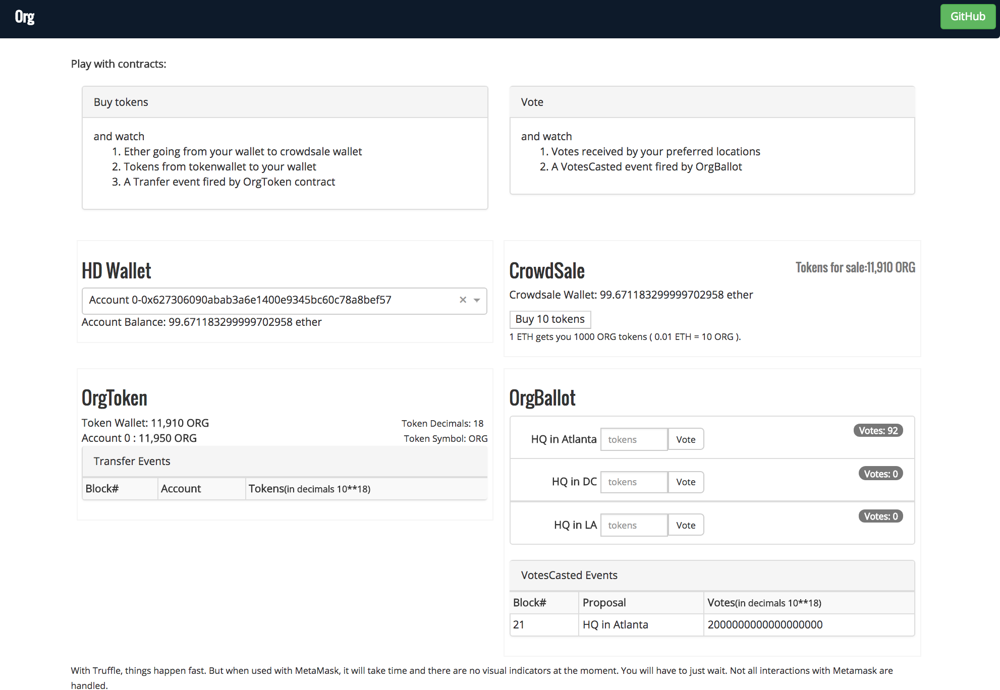
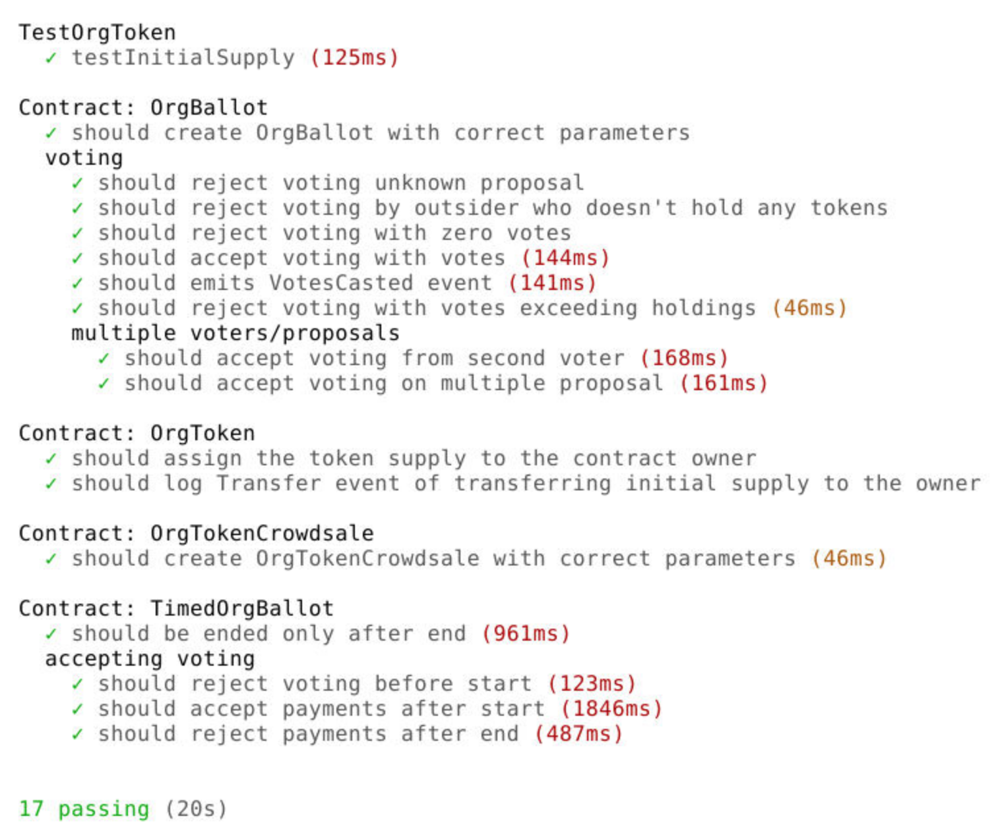

# dapp-token-crowdsale-ballot
# An Org on Ethereum
This POC explores solidity contract development concepts , and use of zeppelin contracts. TDD tests explore key concepts involved in everyday solidity programming.  

This solution consists of solidity contracts for token sale and  token holder voting and a dapp to interact with these contracts.
 
Contracts are deployed on Ropsten and the dapp is [here](http://www.objectcraftworks.com/dapp-token-crowdsale-ballot). You can also download the code and run it locally.

Here is a screenshot of the dapp:  


 
 


To start truffle node:
 ```sh
$  npm install
$  truffle develop
```
To start dapp:
```sh 
$  npm start
```

### Concepts explored
- Solidity
- Dapp's interaction with node using Web3 API
- Events
- Gas Price and Limit
- Interaction between solidity contracts
- Use of Zeppelin 
- ERC20 token standard
- Data type transformations between dapp and node
- Metamask provider
- TDD tests covering
  - Reverts
  - Data type transformations
  - Event tests
### Tests 

### Tech
  - [Truffle Framework](http://truffleframework.com/)
    - [react box](http://truffleframework.com/boxes/react)
  - [ReactJs](https://reactjs.org/)
  - [Mocha](https://mochajs.org/) 
  - [Geth](https://github.com/ethereum/go-ethereum)
  - and [Solidity](https://solidity.readthedocs.io/en/v0.4.21/)
  

### Todos
 - Handle and display errors in UI. 
 - Figure out why promises are not receiving VM reverts.
 - Handling token decimals in events display?
 - Use Drizzle.
 - Switch to TimedOrgBallot to allow election timings.
 - Finalize Crowdsale and Ballot contracts.
 - Explore: allowing multiple elections - A good use case of Factory Pattern.
 - Update account balance on events (of the transactions outside the dapp)
 - Interaction with Metamask/Mist HttpProvider.
 - Dividend payments to token holders


License
----

MIT

